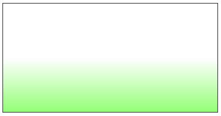
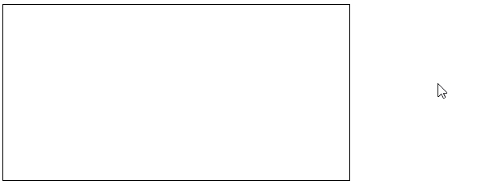

## Project title hover effect, from https://heaven-burns-red.com/character/

<br>
1. Set the linear gradient (and a border to see what's going on) with the color stop at around 50%.

```css
.container {
  width: 50vw;
  height: 50vh;
  background-image: linear-gradient(
    to bottom,
    #ffffff 0,
    #ffffff 50%,
    #93ff75 100%
  );
  border: 1px solid black;
}
```

Output:<br>


2. Set the background y-position to 200%. This gives the effect of shifting where the color starts to transition to the bottom of the container.

```css
.container {
  width: 50vw;
  height: 50vh;
  background-image: linear-gradient(
    to bottom,
    #ffffff 0,
    #ffffff 50%,
    #93ff75 100%
  );
  background-size: 100% 200%;
  border: 1px solid black;
}
```

Output:<br>


This can be seen by changing the color stop to around 45% (you'll just about see where the gradient color starts to tranisition).

Output with `background-image: linear-gradient(to bottom,#FFFFFF 0,#FFFFFF 45%,#93ff75 100%)`:


3. The effect of the transition comes from setting the background y-position from 0% and 100% on the hover state, "pulling" the color to the top of the container.

```css
.container {
  width: 50vw;
  height: 50vh;
  background-image: linear-gradient(
    to bottom,
    #ffffff 0,
    #ffffff 50%,
    #93ff75 100%
  );
  background-size: 100% 200%;
  background-position: 100% 0%;
  /* Add transitions for the background position */
  transition-property: all;
  transition-timing-function: cubic-bezier(0.4, 0, 0.2, 1);
  transition-duration: 150ms;
  border: 1px solid black;
}

.container:hover {
  background-position: 100% 100%;
}
```

Output:<br>


You can then add `color: transparent` and `background-clip: text` on some text so that the background transition only shows under the text.
